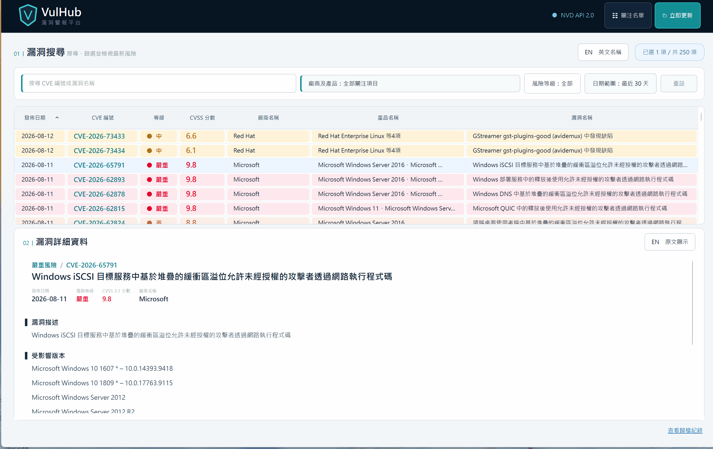
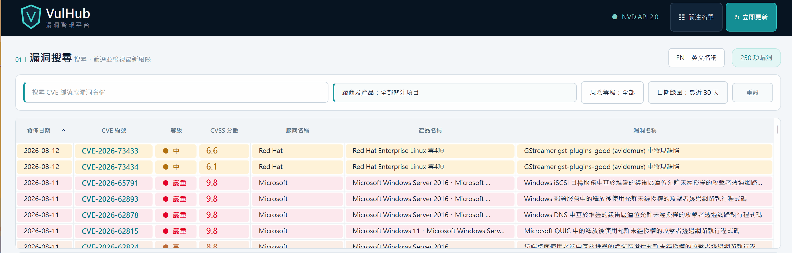
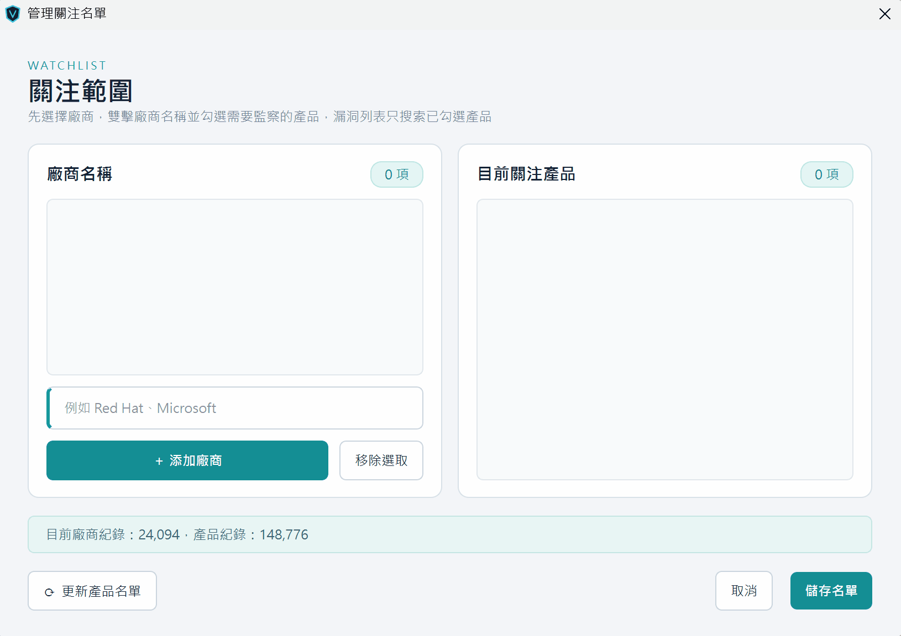
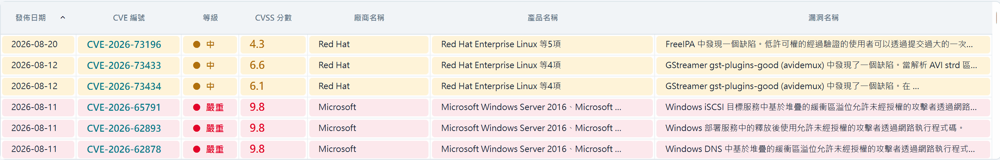
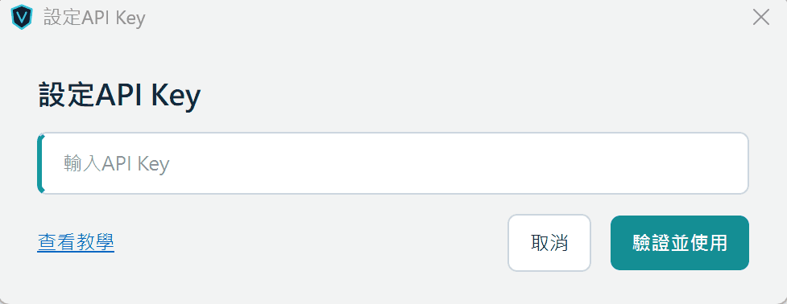

  
  
  

<h1 align="center">VulHub - 漏洞警報平台</h1>

VulHub 是一款使用 Python / PySide6 開發的 Windows 漏洞警報程式，透過國家漏洞資料庫（NVD）追蹤所關注產品的最新 CVE 漏洞披露

## 主要特色
<h3>
1. 簡潔直觀的介面設計，漏洞列表與詳細資訊清晰呈現，快速掌握漏洞內容
</h3>
 

<h3>
2. 一鍵切換中英文顯示，支援中文翻譯及英文原文
</h3>
 

<h3>
3. 用戶友好的搜尋功能與多條件篩選設計，快速定位重點漏洞
</h3>
 

<h3>
4. 零門檻的關注產品管理，只需簡單數個步驟，即可加入需要監察的廠商及其產品
</h3>
 

<h3>
5. 支持匯出為 CSV 檔，並提供靈活的多選操作，包括 Ctrl+A 全選、Shift/拖曳多選及 Ctrl 單選
</h3>
 

<h3>
6. 額外提供 API Key 功能，以提升 API 查詢效率及解決 IP 限流限制
</h3>
 

## 系統需求
- Windows 11 x64
- 使用 NVD 更新漏洞列表及中文翻譯功能時，需要網絡連線

## 使用教學
從 GitHub Releases 下載 `VulHub-Windows-x64.zip`，完整解壓後，確保 `VulHub.exe` 與 `_internal` 資料夾在同一目錄，並雙擊 `VulHub.exe`
 

## 首次使用:
- 首次啟動若出現 `Windows已保護您的電腦` 提示視窗時，請先點擊 `其他資訊`，然後點擊 `仍要執行`，這是由於應用程式無數位簽章而彈出提示，後續啟動不再彈出
- 首次啟動若出現 `智慧型應用程式控制已封鎖可能不安全的應用程式` 提示視窗時，要在Windows裡點選`設定`→`隱私與安全性`→`Windows安全性`→`應用程式與瀏覽器控制`→`智慧型應用程式控制`，點擊`智慧型應用程式控制設定`→點選`關閉`
- 首次啟動程式時，因要建立本機產品索引檔，所需時間會較長，後續啟動直接讀取本地索引檔，因此啟動速度會變回正常
- 首次使用時，請先點擊右上角的 `關注名單`，在搜索框輸入廠商關鍵字，如Red Hat，接著選擇該廠商旗下的產品，然後按 `套用選擇`，系統會自動搜索關注產品的最新漏洞，後續可自行添加其他產品

## 使用說明:
- 每次啟動應用程式時，系統會自動更新漏洞列表，用戶亦可點擊 `立即更新` 手動更新列表
- 本程式提供中文翻譯功能，在搜索結果清單，用戶可點擊 `中文名稱` 或 `英文名稱` 切換搜索結果清單的語言
- 在下方的漏洞詳細資料部分，用戶可點擊 `原文顯示` 或 `中文顯示` 切換漏洞詳細內容的語言
- 支持匯出為CSV功能，用戶在結果列表透過篩選，滑鼠拖曳、SHIFT連續選取、CTRL個別選取及CTRL+A全選，選擇所需的結果後，右鍵並點選 `匯出為CSV檔`
- CSV檔支持中文/英文格式，如需中文格式，請先點擊 `中文名稱`，結果列表顯示為中文時，匯出內容為中文版。英文格式則先點擊 `英文名稱`，結果列表顯示為英文時，匯出內容則為英文版
- 主頁面只會顯示最近30天的所有漏洞內容，超過30天的漏洞則會歸檔，用戶如需查看，請在右下角點擊 `查看歸檔紀錄`，則會顯示30天至最長90天的所有歸檔漏洞紀錄，超過90天的舊有紀錄會自動刪除
- 如用戶需要關注大量產品並要求提高搜索速度，可以自行申請API Key，只需在右上角點擊 `NVD API 2.0`，裡面點擊 `查看教學`，並依照步驟提取API Key後貼上至輸入框，點擊 `驗證並使用`，成功驗證後便會自動使用

## 常見問題:
- 由於漏洞搜索和中文翻譯需要網絡連線，如中途提示錯誤時，請先檢查網絡問題，如確定網絡沒有問題，但相關錯誤仍存在時，原因有可能為：NVD或Google翻譯功能正在維護，請隔一段時間再試；或IP被限流，請點擊右上角的NVD API 2.0，按照教學申請，並輸入API KEY以解除限制
- 如果關注名單沒有搜索到新的廠商及其產品，可以手動點擊 `更新產品名單`，系統會自動對比本地和NVD兩者清單，然後添加增量部分並儲存在本地索引
- 由於產品名單是由NVD提供，可能會出現部分產品名稱相似的情況，建議把這些名稱相似產品都先添加在內，再逐一對比紀錄或全數保留
- 如果部分產品發現搜索無結果或結果數量很少，這是正常情況，因為漏洞列表只會顯示最近30天內通報的紀錄，如不在該時間範圍通報的紀錄便不會顯示

## 資料來源

- NVD (National Vulnerability Database): https://nvd.nist.gov/

## 私隱政策

- VulHub 只會在使用者開啟程式、手動更新或使用中文翻譯功能時，向 NVD API 與 Google 翻譯服務傳送查詢所需的公開漏洞資料。程式不會傳送使用者的關注名單、API Key、資料庫或其他個人資料
